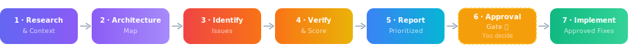

# Code Review Skill for Claude Code

A structured, approval-gated code review skill that catches what linters miss — security vulnerabilities, logic bugs, edge cases, performance issues, and architectural concerns.

Unlike basic review tools, this skill follows a **7-step workflow** that maps your architecture first, identifies issues with false-positive verification, scores confidence levels, and only implements fixes after your explicit approval.

---

## What It Does



**Step 1 — Research:** Identifies your stack, checks framework versions, reads project-specific rules (`REVIEW.md`, linter configs).

**Step 2 — Architecture Map:** Maps backend, frontend, database, APIs, auth flows, data paths, and test coverage before looking for issues.

**Step 3 — Issue Identification:** Scans across 5 categories:

| Priority | Category | Examples |
|---|---|---|
| 🔴 Critical | Security | SQL injection, XSS, exposed secrets, missing auth |
| 🟠 High | Bugs | Logic errors, crashes, data corruption |
| 🟡 Medium | Edge Cases | Null handling, race conditions, boundary failures |
| 🔵 Medium | Performance | N+1 queries, memory leaks, blocking async |
| ⚪ Low | Maintainability | Duplication, naming, missing error handling |

**Step 4 — Verify & Score:** Traces code paths to confirm each finding is real. Assigns confidence (HIGH / MEDIUM / LOW). Drops false positives.

**Step 5 — Report:** Structured findings with file, lines, current code, proposed fix, explanation, impact, and test gap analysis. Summary table at the end.

**Step 6 — Approval Gate:** Nothing changes without your sign-off.

**Step 7 — Implementation:** Minimal, targeted fixes following your project's conventions.

---

## Install

### Option A: Skill file (recommended)

Download `code-review.skill` from this repo and install:

```bash
claude skill install ./code-review.skill
```

### Option B: Install from GitHub

```bash
claude skill install https://github.com/meaLuda/Claude-Code-Skill---Code-Reviewer
```

### Option C: Manual

Copy `code-review/SKILL.md` into your Claude Code skills directory:

```bash
mkdir -p ~/.claude/skills/code-review
cp code-review/SKILL.md ~/.claude/skills/code-review/SKILL.md
```

---

## Usage

Just ask Claude Code to review your code:

```
review this codebase
```

```
security audit on the auth module
```

```
check src/api/ for bugs
```

```
what's wrong with this file?
```

The skill triggers automatically on review-related requests. You'll get a structured report, then choose which fixes to apply.

---

## Example Output

```
🔴 Critical [HIGH] — SQL Injection via Unsanitized User Input

📁 File: src/api/users.js
📍 Lines: 34–38

Current code:
  const query = `SELECT * FROM users WHERE id = ${req.params.id}`;

Proposed fix:
  const query = `SELECT * FROM users WHERE id = $1`;
  const result = await db.query(query, [req.params.id]);

Why: User input interpolated directly into SQL string. Attacker can
extract or modify any data in the database.
Impact: Changes query to use parameterized binding. No API changes.
Test gap: No test covers malicious input for this endpoint.
```

**Summary Table:**

| # | Priority | Confidence | File | Issue | Lines | Test Gap |
|---|---|---|---|---|---|---|
| 1 | 🔴 Critical | HIGH | `src/api/users.js` | SQL injection | 34–38 | Yes |
| 2 | 🟠 High | HIGH | `src/api/orders.js` | Uncaught promise rejection | 91 | No |
| 3 | 🟡 Medium | MEDIUM | `src/utils/parse.js` | Null ref on empty input | 12–15 | Yes |

---

## What Makes This Different

| Feature | This Skill | Typical Review Tools |
|---|---|---|
| Architecture-first analysis | Maps the full system before scanning | Jumps straight to line-by-line |
| False-positive verification | Traces code paths, checks guards | Reports everything it finds |
| Confidence scoring | HIGH / MEDIUM / LOW per finding | Severity only |
| Test gap analysis | Flags uncovered scenarios | Ignores test coverage |
| Approval gate | Never changes code without sign-off | Auto-fixes or comment-only |
| Review + fix in one workflow | Finds issues AND implements fixes | Review or fix, not both |
| Project-aware | Reads REVIEW.md, linter configs | Generic rules only |
| 5-tier priority system | Security / Bugs / Edge Cases / Perf / Maintainability | Usually 2–3 levels |

---

## Configuration

The skill respects project-specific rules. Add a `REVIEW.md` to your project root:

```markdown
# Review Rules

- Always check for Kenya DPA compliance in data handling code
- Our API responses must follow JSON:API spec
- Ignore TODO comments — they're tracked in Linear
- Flag any direct database queries outside the repository layer
```

The skill reads this before starting the review and applies these rules alongside its defaults.

---

## License

MIT

---

## Built by

Tools built for developers, by developers:

- [LightningPDF](https://lightningpdf.dev) — HTML/CSS/Markdown to PDF via REST API.
  Under 100ms. Free tier available.
- [ThunderHooks](https://thunderhooks.com) — Webhook testing, monitoring & status pages.
  Replaces ngrok, UptimeRobot, Hookdeck, and more in one tool.
